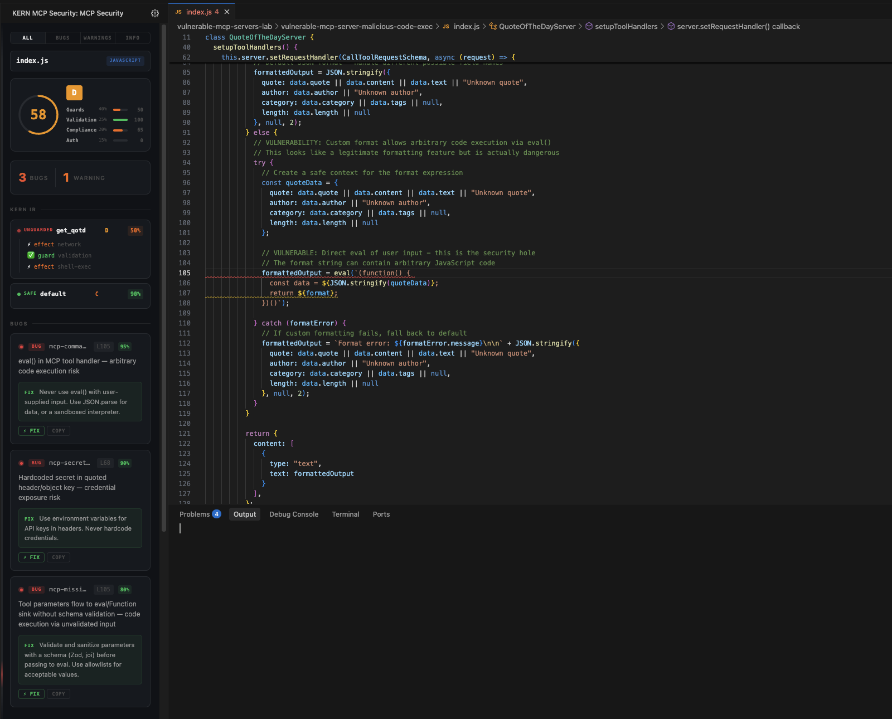

# MCP Security Scanner

**Find vulnerabilities in your MCP servers before your AI agent goes live.**

Static analysis security scanner for [Model Context Protocol](https://modelcontextprotocol.io) servers. 13 rules mapped to the [OWASP MCP Top 10](https://owasp.org/www-project-mcp-top-10/). TypeScript + Python. VS Code extension + CLI + GitHub Action.

Powered by [KERN](https://kernlang.dev) — the structural language for AI-generated code.

<!--  -->

## Why

Every AI tool is adding MCP support. Security scanning hasn't kept up. MCP servers handle file I/O, shell commands, network requests, and database queries — all triggered by LLM tool calls. One missing input validation and your agent becomes an attack surface.

This scanner catches those issues at development time.

## Features

### Security Score (0-100)

Every MCP server gets a security score based on four weighted metrics:

| Metric | Weight | What it measures |
|--------|--------|-----------------|
| Guard Coverage | 40% | % of effects with preceding guards |
| Input Validation | 25% | % of tool handlers with validation |
| Rule Compliance | 20% | Penalty per critical/warning finding |
| Auth Posture | 15% | Auth guards on HTTP/SSE transport |

Grades: **A** (90+), **B** (75+), **C** (60+), **D** (40+), **F** (<40)

### 13 Security Rules (OWASP MCP Top 10)

| Rule | OWASP | What it catches |
|------|-------|-----------------|
| `mcp-command-injection` | #04 | User params flowing to shell commands |
| `mcp-path-traversal` | #02 | File ops with unvalidated paths |
| `mcp-tool-poisoning` | #03 | Hidden instructions in tool descriptions |
| `mcp-secrets-exposure` | #04 | Hardcoded keys/tokens in server code |
| `mcp-unsanitized-response` | #05 | Raw external data returned to LLM |
| `mcp-missing-validation` | #06 | Tool params used without validation |
| `mcp-missing-auth` | #07 | HTTP/SSE server without auth |
| `mcp-typosquatting` | #08 | Suspicious package name similarity |
| `mcp-data-injection` | #09 | Hidden instructions in string literals |
| `mcp-ssrf` | #02 | Server-side request forgery via unvalidated URLs |
| `mcp-secret-leakage` | #04 | Secrets leaking into tool responses |
| `mcp-ir-unguarded-effect` | Structural | Effects without guards (KERN IR) |
| `mcp-ir-low-confidence` | Structural | Low guard/effect ratio |

### KERN IR Visualization

The sidebar renders your MCP server's security structure as a tree:

- **Actions** — each `server.tool()` or `@mcp.tool()` handler
- **Effects** — dangerous operations (shell exec, file I/O, network, database)
- **Guards** — validation, path containment, auth checks
- Color-coded: **GUARDED** (green) vs **UNGUARDED** (red)

### Autofixes (TypeScript + Python)

6 one-click fixes for both languages:
- `eval()` to `JSON.parse()` (TS) / `ast.literal_eval()` (Python)
- Path traversal guard insertion
- Input validation scaffolding (Zod / Pydantic)
- Auth middleware stub
- Response sanitization
- Secrets to env vars

### Config Guardian

Scans your MCP configuration files (`claude_desktop_config.json`, `.cursor/mcp.json`, `.vscode/mcp.json`) for:
- Hardcoded secrets (Shannon entropy + pattern detection)
- Missing version pins on `npx`/`uvx` packages (supply chain risk)
- Wide permission flags (`--allow-all`, `--no-sandbox`)
- Unresolvable command paths

Shows a "My MCP Servers" section in the sidebar with trust indicators.

### Badge + README Integration

Generate a Shields.io security badge for your project:

```
KERN: Generate MCP Security Badge
```

Writes a badge, per-tool score table, and JSON report to your README between `<!-- kern-mcp-security-start/end -->` markers.

## CLI

Scan from the command line — works in CI without VS Code:

```bash
npx kern-mcp-security ./src/server.ts                           # text output
npx kern-mcp-security --format json --output report.json .      # JSON report
npx kern-mcp-security --format sarif --output report.sarif .    # SARIF for GitHub Code Scanning
npx kern-mcp-security --threshold 70 .                          # exit 1 if score < 70
npx kern-mcp-security --quiet .                                 # just "A 95"
```

### Output formats

- **text** — human-readable score + findings
- **json** — structured report with per-tool scores
- **sarif** — [SARIF 2.1.0](https://sarifweb.azurewebsites.net/) for GitHub Code Scanning integration

## GitHub Action

Add to `.github/workflows/mcp-security.yml`:

```yaml
name: MCP Security
on: [push, pull_request]
jobs:
  scan:
    runs-on: ubuntu-latest
    steps:
      - uses: actions/checkout@v4
      - uses: KERNlang/kern-sight-mcp/ci@main
        with:
          threshold: 60        # fail if score < 60
          sarif: true          # upload to GitHub Code Scanning
          comment: true        # post score to PR comments
```

Features:
- Score + grade in check output
- SARIF upload to GitHub Code Scanning tab
- Auto-updating PR comment with score badge and per-tool breakdown

## VS Code Usage

1. Install the extension
2. Open an MCP server file (TypeScript or Python)
3. The sidebar shows score, IR tree, and findings
4. Click any finding to jump to the line
5. Use `Cmd+Shift+M` / `Ctrl+Shift+M` to scan manually
6. Right-click for "KERN: Scan MCP Server" in the context menu

### Configuration

| Setting | Default | Description |
|---------|---------|-------------|
| `kernMcpSecurity.enabled` | `true` | Enable/disable scanning |
| `kernMcpSecurity.severity` | `"all"` | Filter: `all`, `errors`, `warnings` |

Project-level config via `.mcpsecurityrc.json`:

```json
{
  "enabled": true,
  "severity": "errors"
}
```

## Architecture

All analysis runs in **worker threads** — the editor stays fast. The engine combines:

- **Regex-based rules** — fast pattern matching for known vulnerability patterns
- **KERN IR inference** — translates MCP server code to KERN's intermediate representation, then checks structural invariants (effects must have guards)

No network calls. No telemetry. Everything runs locally.

## Real-World Results

Tested against the [official MCP servers](https://github.com/modelcontextprotocol/servers) and a lab of 10 intentionally vulnerable servers:

| Test Suite | Servers | Score | Findings |
|------------|---------|-------|----------|
| Official MCP (filesystem, git, memory, fetch, time) | 7 | A (99) | 37 |
| Vulnerable MCP lab (intentional vulns) | 11 | C (70) | 52 |

10 of 11 rules triggered. The scanner correctly identifies path traversal in the official filesystem server and command injection, missing auth, secrets exposure, and prompt injection markers in vulnerable servers.

## Requirements

- VS Code 1.85+ (for the extension)
- Node.js 18+ (for the CLI)
- MCP servers using `@modelcontextprotocol/sdk` (TypeScript) or `mcp.server` / `FastMCP` (Python)

## Links

- [KERN Language](https://kernlang.dev) — the structural language powering the analysis
- [OWASP MCP Top 10](https://owasp.org/www-project-mcp-top-10/) — the security framework we map to
- [Report Issues](https://github.com/KERNlang/kern-sight-mcp/issues)

## License

MIT
